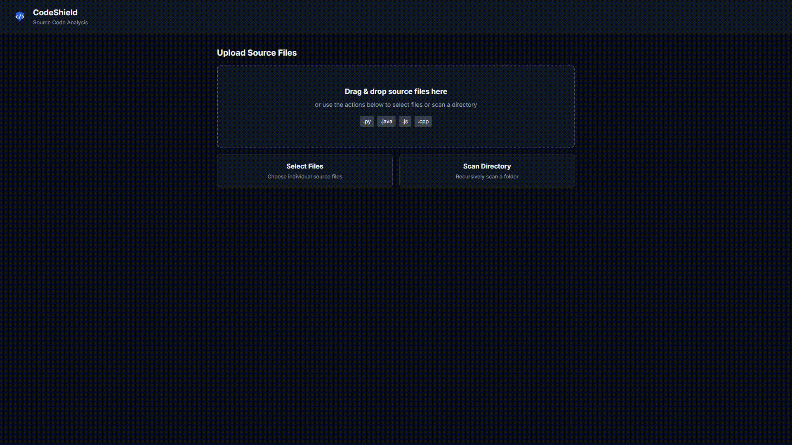

# CodeShield

A browser-based static analyzer for `.py`, `.java`, `.js`, and `.cpp` source files. Runs entirely client-side — files never leave your machine.



### Prerequisites
- Node.js v18+
- npm

### Setup and Run
1. Clone the repository.
2. Install dependencies:
   ```bash
   npm install
   ```
3. Start the dev server:
   ```bash
   npm run dev
   ```
4. Open the local URL printed in the terminal.

### Features
- **File Upload** — Drag-and-drop, file picker, or recursive directory scan. Validates extension, size, binary content, and line count (10,000-line cap).
- **Cyclomatic Complexity** — Per-function decision-point count, aggregated per file, with per-language parsers.
- **Vulnerability Scanning** — Regex-based pattern matching per language. Skips line and block comments so commented-out code is not flagged.
- **Technical Debt Index (TDI)** — `TDI = NormalizedComplexity * 0.5 + VulnDensity * 0.5`, where vuln density is vulnerabilities per 1,000 LOC.
- **Configurable Thresholds** — TDI (default 50), per-function complexity (default 10), and vuln density (default 20). A module is flagged when its TDI exceeds the TDI threshold or its vuln density exceeds the density threshold. Settings persist in `localStorage`.
- **Results View** — Ranked file cards with risk badges (Low / Medium / High / Critical) and a per-function complexity table. Click a card to drill into a detail view with Prism-highlighted source snippets and remediation hints.
- **Visual Dashboard** — KPI strip plus four Chart.js charts: TDI distribution, top 10 high-risk modules, vulnerability type breakdown, and complexity distribution.
- **Export** — CSV (Excel-friendly) and PDF (multi-page, branded) report downloads. The PDF generator is loaded on demand to keep the initial bundle small.

### Running the Tests
```bash
npm run test
```

Two Jest suites run in Node (no browser): `tests/complexity.test.js` covers the cyclomatic-complexity calculator across languages, and `tests/security.test.js` covers the rule-based security scanner. These exercise the analysis modules in isolation — they do **not** test the file-upload UI; that is verified manually in the dev server.

### Building for Production
```bash
npm run build
```

Outputs to `dist/`. `npm run preview` serves the built bundle locally.
